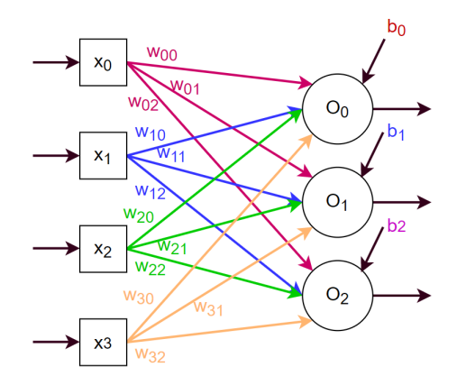

# Question

Consider the following Artificial Neural Network (ANN).

* `wij` are weight values
* `x` is the input vector <x0 ... xi>
* `O` is the output vector <O0 ... Oj>
* `b` is the bias vector <b0 ... bj>
* 0 <= i <= 3 and 0 <= j <= 2

Consider the following weight and bias values:

| Parameter | Value |
|-----------|-------|
| w00       | 0.25  |
| w01       | 0.12  |
| w02       | 0.13  |
| w10       | 0.24  |
| w11       | 0.14  |
| w12       | 0.25  |
| w20       | 0.19  |
| w21       | 0.17  |
| w22       | 0.33  |
| w30       | 0.21  |
| w31       | 0.17  |
| w32       | 0.22  |
| b0        | 0.5   |
| b1        | 0.5   |
| b2        | 0.5   |

Find the output for these input vectors:

| <x0 ... xi> |
|-------------|
| <5, 3, 7, 4> |
| <2, 1, 7, 3> |
